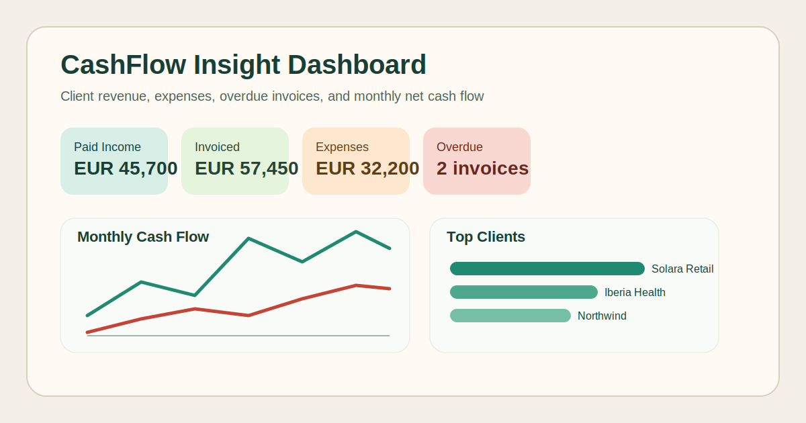

# CashFlow Insight Dashboard

`CashFlow Insight Dashboard` is a recruiter-friendly data analytics project built around a realistic business scenario: understanding how client revenue, invoice payments, expenses, and monthly cash flow affect a company's financial health.



This project is designed to support junior applications in:

- data analysis
- business intelligence
- operations analytics
- finance data reporting

## What the project shows

- data modeling with related finance datasets
- KPI calculation with Python and Pandas
- SQL reporting with SQLite
- time-series cash flow analysis
- client revenue and payment behavior analysis
- expense category breakdowns
- interactive visual storytelling with Streamlit and Plotly

## Business questions answered

- How much income and expense did the company generate each month?
- Which clients bring the most revenue?
- Which invoices are still overdue?
- Which expense categories are growing fastest?
- What is the monthly net cash flow trend?
- Which clients are paying late most often?

## Stack

- Python 3.12+
- Pandas
- Plotly
- Streamlit
- Pytest

## Project structure

- `data/clients.csv`
- `data/invoices.csv`
- `data/payments.csv`
- `data/expenses.csv`
- `app/analysis.py`
- `app/db.py`
- `app/sql_queries.py`
- `app/dashboard.py`
- `app/build_database.py`
- `sql/schema.sql`
- `tests/test_analysis.py`

## Run locally

```powershell
python -m venv .venv
.venv\Scripts\Activate.ps1
pip install -r requirements.txt
python -m app.build_database
streamlit run app/dashboard.py
```

## Run the SQL layer

```powershell
python -m app.build_database
```

This creates `cashflow_insight.db`, which can be used for SQL reporting and future BI extensions.
By default, the SQLite file is created in your system temp folder to avoid OneDrive file-locking issues on Windows. You can override the location with the `CFI_DB_DIR` environment variable.

## Example SQL reporting areas

- monthly cash flow trend
- top clients by revenue
- average payment delay by client
- expense breakdown by category
- overdue invoice tracking

See [sample_queries.sql](docs/sample_queries.sql) for recruiter-friendly reporting examples.

## Example insights from the demo data

- Cash collected is `EUR 45,700`, while total invoiced revenue is `EUR 57,450`, which highlights a collections gap.
- Net cash flow across the demo period is `EUR 13,500`.
- `Solara Retail` is the top revenue-generating client in the current dataset.
- There are `2` invoices in late or overdue status, which makes receivables risk visible in the dashboard.

## Main dashboard sections

- Executive summary with KPI cards
- Monthly income, expense, and net cash flow trends
- Client revenue ranking
- Late payment analysis
- Expense distribution by category
- Monthly finance table for quick review

## Why it is good for recruiters

This is not only a dashboard. It shows business understanding, realistic financial reporting logic, clear data storytelling, clean Python project structure, and a reproducible SQLite reporting layer in one repository.

## Portfolio talking points

- Built a finance analytics dashboard with Python, Pandas, Streamlit, Plotly, and SQLite.
- Modeled related datasets for clients, invoices, payments, and expenses.
- Wrote reusable SQL queries for KPI reporting and trend analysis.
- Combined business-domain knowledge with technical implementation and tests.
- Designed the project so recruiters can understand the value in under a minute.

## How to present this in interviews

- Explain that the project simulates a real small-business finance reporting workflow.
- Walk through how CSV data becomes a SQLite reporting layer and then a visual dashboard.
- Highlight the difference between revenue invoiced and cash actually collected.
- Show how late payment behavior and expense trends affect business decisions.

## Next improvements

- add SQL queries with SQLite or PostgreSQL
- add CSV upload for new finance files
- add forecasting for future cash flow
- add cohort analysis for recurring clients
